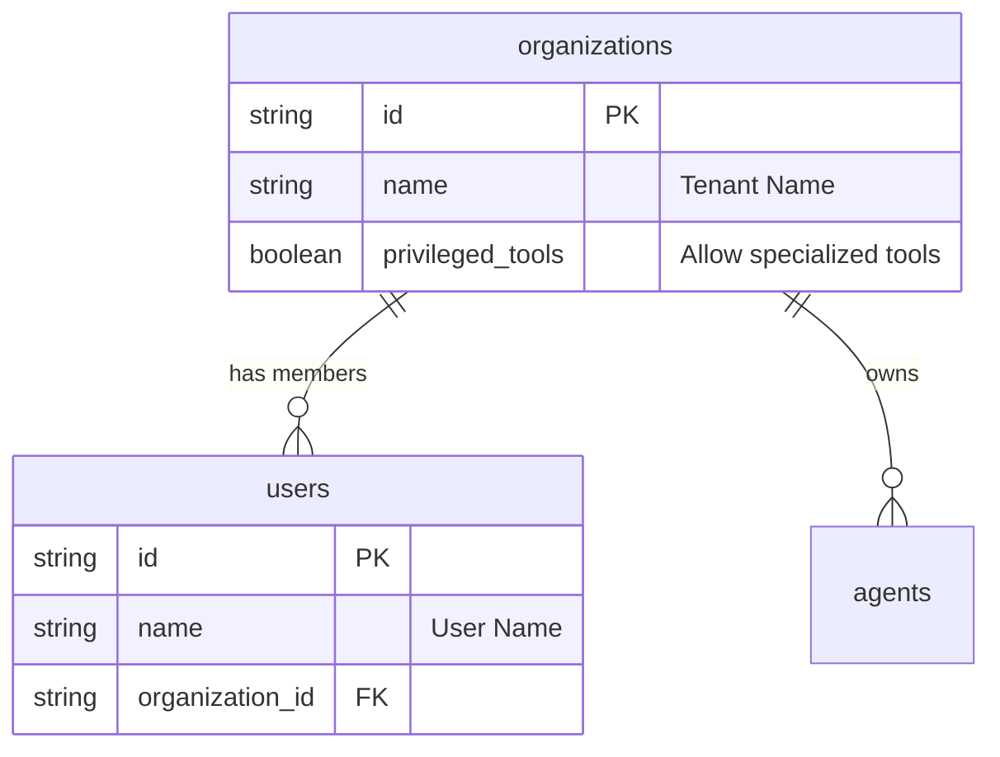
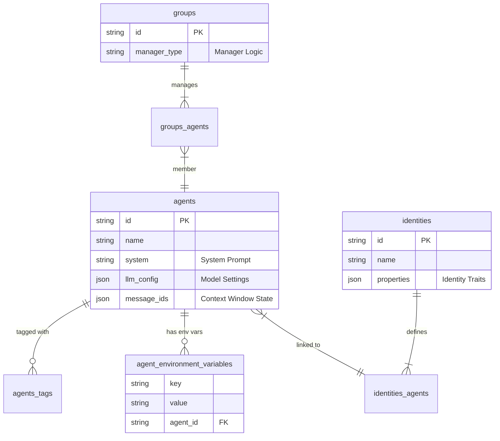
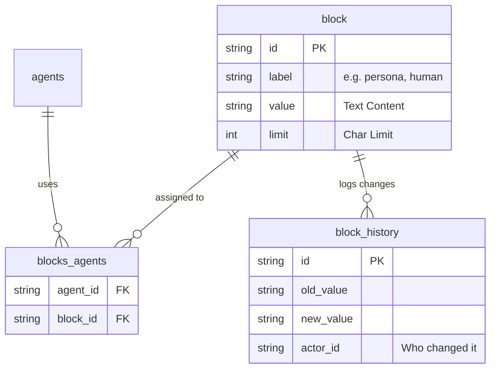
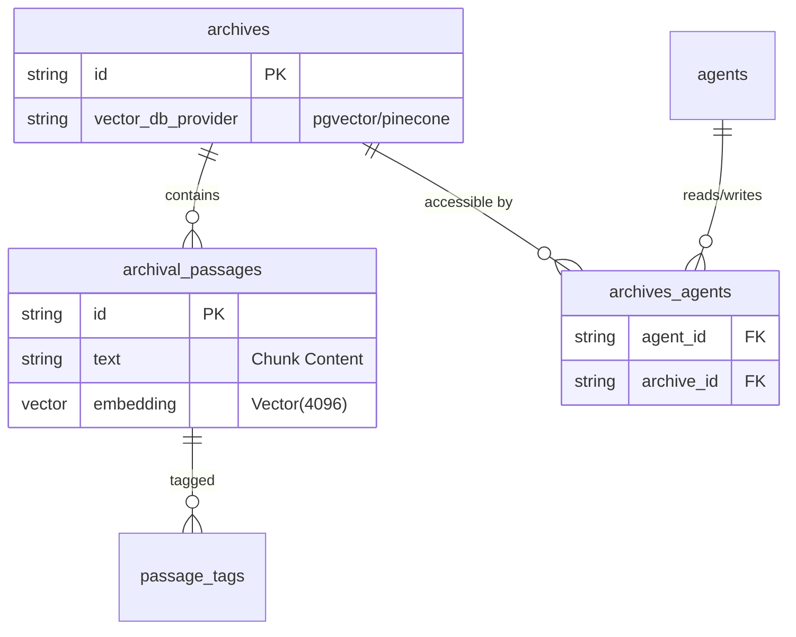
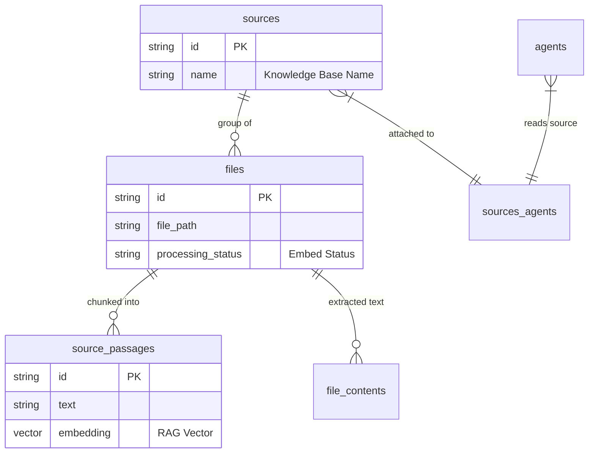
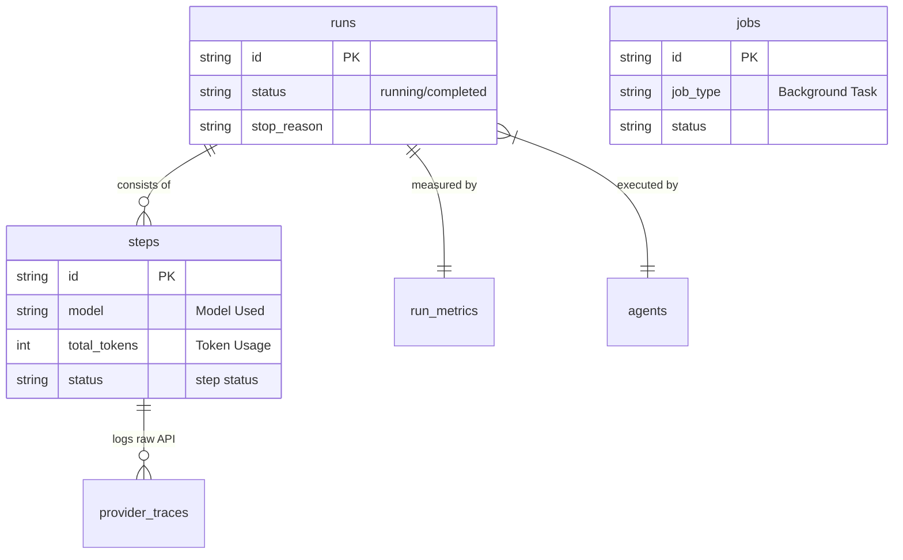
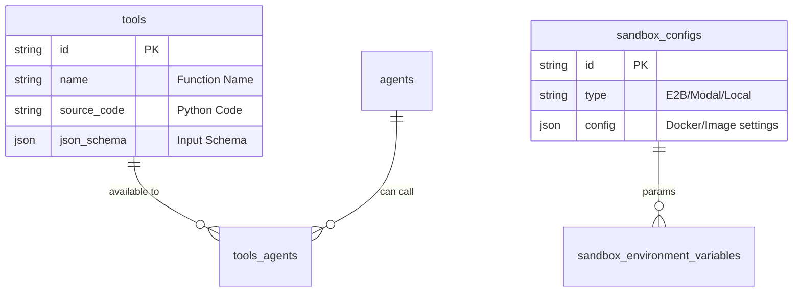
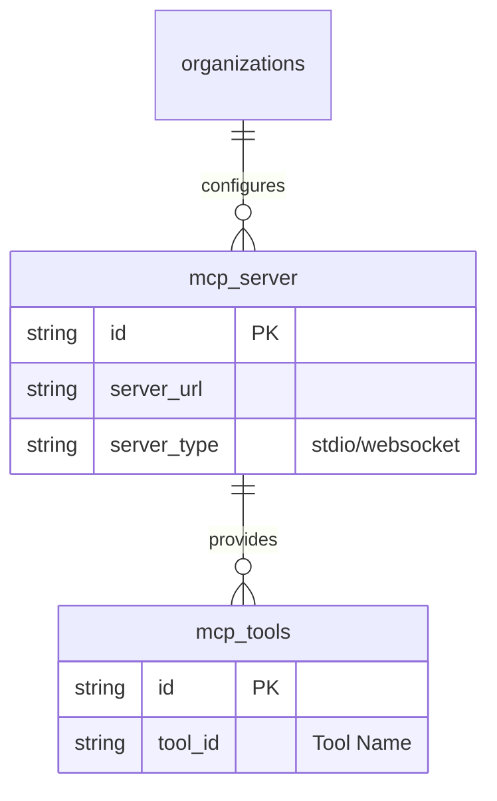
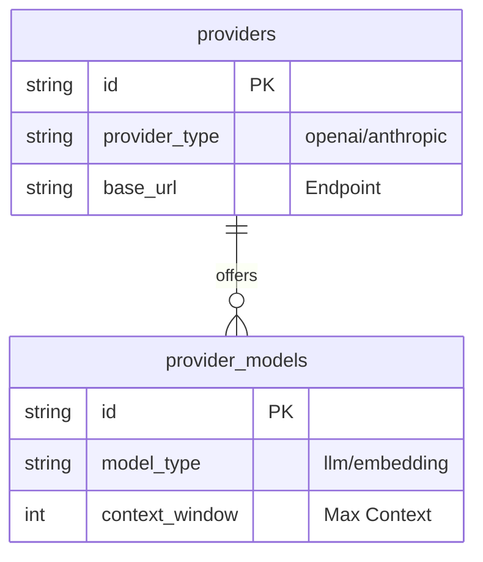

# Tài Liệu Chi Tiết Database Schema của Letta

Tài liệu này cung cấp mô tả chi tiết về từng bảng trong cơ sở dữ liệu PostgreSQL của dự án Letta, kèm theo biểu đồ quan hệ (ERD).

## 1. Core Entities (Thực thể Cốt lõi)

Nền tảng của hệ thống multi-tenant.

| Bảng | Chức năng | Các cột quan trọng |
| :--- | :--- | :--- |
| **`organizations`** | Đại diện cho một tenant hoặc tổ chức. Mọi dữ liệu (agent, user, source) đều thuộc về một organization cụ thể. | `id` (PK), `name`, `privileged_tools` (quyền chạy tool đặc biệt). |
| **`users`** | Người dùng cuối hoặc thành viên trong tổ chức. | `id` (PK), `name`, `organization_id` (FK). |

## 2. Agents System (Hệ thống Agent)

Lưu trữ trạng thái, cấu hình và danh tính của AI Agent.

## 3. Memory Systems (Hệ thống Bộ nhớ)

Letta chia bộ nhớ thành 2 loại chính: **Block Memory** (Bộ nhớ lõi/ngắn hạn) và **Archival Memory** (Bộ nhớ lưu trữ/dài hạn).

### A. Block Memory (Core Memory)
Lưu trữ thông tin luôn nằm trong context window của LLM.

### B. Archival Memory (RAG / Vector Store)
Lưu trữ dữ liệu lớn, được truy xuất qua vector search.

## 4. Resources: Sources & Files (Tài nguyên dữ liệu)

Quản lý dữ liệu bên ngoài (File upload) để nạp vào bộ nhớ.

## 5. Execution & Tracing (Thực thi & Giám sát)

Theo dõi quá trình hoạt động, suy luận và gọi công cụ của Agent.

## 6. Tools & Sandbox (Công cụ & Môi trường chạy code)

Quản lý khả năng mở rộng của Agent qua Tool và môi trường thực thi an toàn.

## 7. Model Context Protocol (MCP)

Hỗ trợ chuẩn MCP để kết nối Agent với các thế giới dữ liệu bên ngoài.

## 8. Providers Interface (Kết nối LLM)

Cấu hình các nhà cung cấp mô hình ngôn ngữ.

